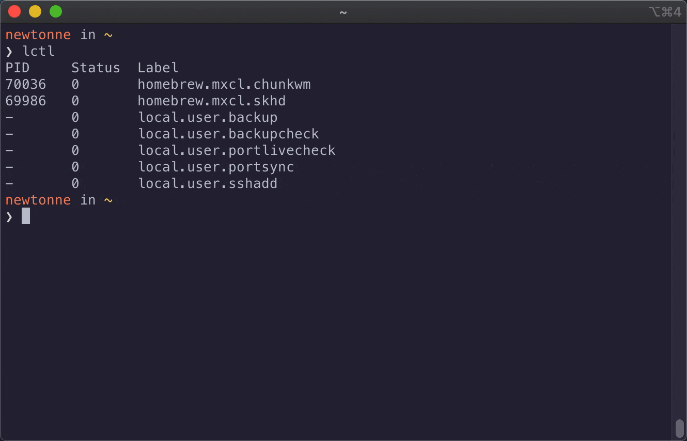

# lctl

User-friendly launchctl wrapper and helper functions

## Features

- Easy CLI management of launchd user agents
- Written in bash and compatible with bash 3.2 (pre-installed version in macOS)
- Bash tab-completion for commands and agents
- No dependencies required beyond a base macOS install
- Tested on macOS 10.15 Catalina



## Installation

Clone the repo and copy `lctl` to a directory in your `$PATH` e.g. `/usr/local/bin`:

```bash
git clone git@github.com:newtonne/lctl.git
cd lctl && sudo cp lctl.sh /usr/local/bin/lctl
```

Optionally, bash tab-completion can also be installed:

```bash
mkdir -p ~/.local/share/bash-completion/completions
cp completions/lctl.bash ~/.local/share/bash-completion/completions/lctl
echo ". ~/.local/share/bash-completion/completions/lctl" >> ~/.bash_profile # may not be necessary
```

## Usage

```
lctl - user-friendly launchctl wrapper and helper functions

USAGE
    lctl COMMAND AGENT
    lctl list|listdisabled|print
    lctl [-h|--help]

COMMANDS
    cat             print plist file to stdout
    edit            edit plist file in $EDITOR
    file            print plist file path to stdout
    listdisabled    list disabled agents
    log             view stdout and stderr logs in $PAGER
    logfiles        print stdout and stderr log file paths to stdout
    reload          shortcut for bootout => bootstrap
    tail            tail stdout log file

    bootout         unload the agent
    bootstrap       load the agent
    disable         prevent the agent from being loaded
    enable          enable the agent
    kickstart       execute the agent immediately
    kill            send SIGTERM to the agent
    list            summary of all agents or info on specific agent
    print           information about the domain or a specific agent

    See launchctl(1) for more information on second set of commands.

AGENT
    Case-insensitively glob matched against .plist files in
        ~/Library/LaunchAgents

EXAMPLES
    lctl reload myagent   bootout then bootstrap agent defined in
                              ~/Library/LaunchAgents/*myagent*.plist
    lctl listdisabled     list all disabled launchd user agents
```

## Licensing

This project is licensed under the MIT License - see the [LICENSE](LICENSE) file for details
